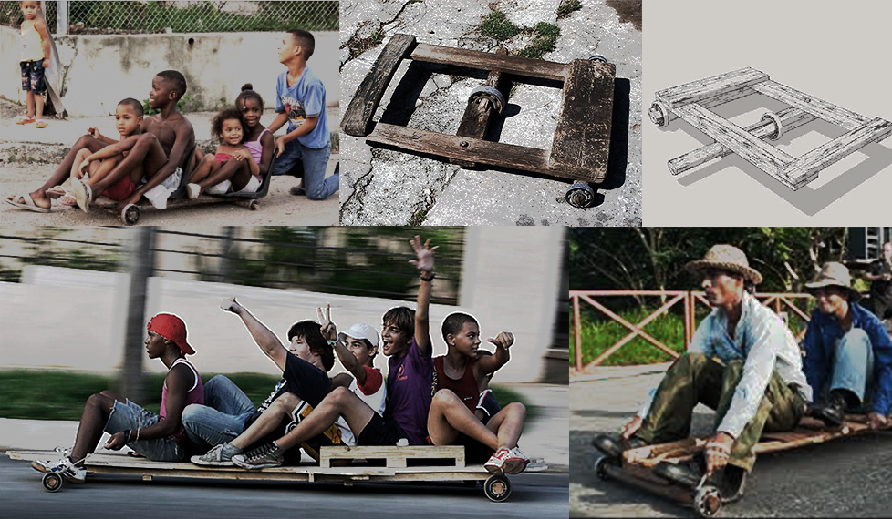

# Welcome to Chivichana land ✨

### In this tutorial we will be learning openscad with a practical use case
> The Chivichana is a popular low tech skate board used widely in places like Cuba. Because it is often made with local resources in many communities and neighborhoods, people come up with all kinds of designs and ideas. For this context if would be nice to make a customizable model and/or a redesign.

### Tips
#### **Less is more here** 👍
Make it easy for yourself to get started
* Lets start with the simplest possible model, using the simplest primitives as a first iteration.

* Try to reuse some parts from available components from the MCAD library. Feel free to also search in thingiverse for inspiration.

* Plan for a customizable design so that users can change some dimensions and component parameters like the bearings.

* Copy and paste code snippets from [OpenSCAD cheat sheet](http://www.openscad.org/cheatsheet/)

* As a second iteration you can propose more advanced design features and ideas.

## ➡️ Use the [Step-by-step guide](03_Tutorial_Resources.md) provided in the ```02_Tutorial_resources.md```
