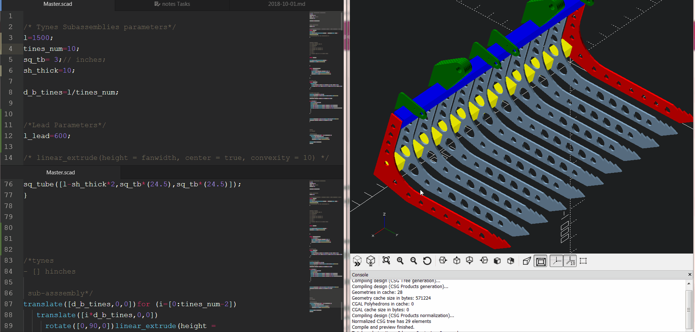

# OpenSCAD intro

### 🚀 Download it and try it!

- [Download the Snaphsot version of OpenSCAD to work with the customizer.](http://www.openscad.org/downloads.html)

### 👇This one is optional but I recommend it 👌
- [Download ATOM](https://atom.io/). Work with a powerful text editor like ATOM, is way better and has packages for OpenSCAD language.
### What is OpenSCAD
Its a free open source software to create 3D parts.[Read more...](http://spolearninglab.com/curriculum/lessonPlans/hacking/resources/software/3d/openscad_intro.html)
### How OpenSCAD works
OpenSCAD is not an interactive modeller. Instead it reads in statements that describes the object and it renders the 3D model from that code.[Readmore](http://spolearninglab.com/curriculum/lessonPlans/hacking/resources/software/3d/openscad_intro.html)

### Why OpenSCAD
- No need to pay expensive licenses.
- Models are easier to maintain and customize compared to available interactive modellers like Inventor, or Solidworks

## 👇 Look at this awesome example!!!

